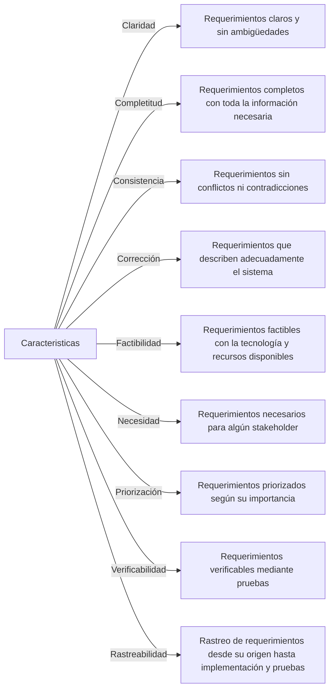

# Características de los requerimientos

Los requerimientos en la ingeniería de software son las descripciones de lo que un sistema debe hacer o las cualidades que debe tener. Los requerimientos pueden ser funcionales, describiendo las funciones que el sistema debe realizar, o no funcionales, describiendo las propiedades que el sistema debe tener. Independientemente del tipo, los buenos requerimientos comparten ciertas características clave:

1. **Claridad**: Los requerimientos deben ser claros y sin ambigüedades. Cada requerimiento debe tener un solo significado para evitar confusiones.
2. **Completitud**: Cada requerimiento debe ser completo, es decir, debe proporcionar toda la información necesaria para su implementación.
3. **Consistencia**: Los requerimientos no deben tener conflictos entre sí. Si dos requerimientos se contradicen, se debe resolver la contradicción.
4. **Corrección**: Un requerimiento es correcto si describe adecuadamente el sistema que se desea.
5. **Factibilidad**: Los requerimientos deben ser factibles con la tecnología y los recursos disponibles.
6. **Necesidad**: Cada requerimiento debe ser necesario para algún stakeholder. Si no es necesario, puede ser una buena idea eliminarlo para simplificar el sistema.
7. **Priorización**: Los requerimientos deben ser priorizados para indicar su importancia relativa.
8. **Verificabilidad**: Debe ser posible verificar que cada requerimiento se ha implementado correctamente. Esto a menudo significa que debe ser posible escribir pruebas para cada requerimiento.
9. **Rastreabilidad**: Debe ser posible rastrear cada requerimiento a través del proceso de desarrollo, desde su origen hasta su implementación y pruebas.

Estas características ayudan a asegurar que los requerimientos sean de alta calidad y que el sistema resultante cumpla con las necesidades de los stakeholders.
