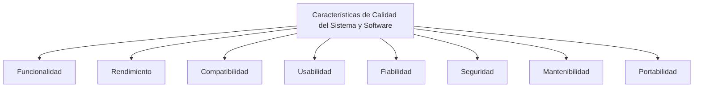

# La Norma ISO 25010: Un Análisis Detallado de sus Características

## Introducción

La norma ISO 25010 es una parte integral de la serie de estándares ISO 25000, también conocida como SQuaRE (System and Software Quality Requirements and Evaluation). Esta norma específica proporciona un modelo para la calidad del producto de software. En este artículo, exploraremos en profundidad las características clave de la norma ISO 25010.

## ¿Qué es la Norma ISO 25010?

La norma ISO 25010 proporciona un marco para entender y evaluar la calidad de un producto de software. Esta norma define un conjunto de características de calidad que se deben considerar al evaluar un producto de software. Estas características se dividen en dos categorías principales: características de calidad del sistema y software, y características de calidad en uso.

## Características de Calidad del Sistema y Software

Las características de calidad del sistema y software se refieren a las propiedades inherentes del software que lo hacen apto para su uso. Estas características incluyen:

1. **Funcionalidad**: Se refiere a la capacidad del software para proporcionar funciones que satisfacen las necesidades explícitas e implícitas cuando el software se utiliza bajo condiciones especificadas.
2. **Rendimiento**: Se refiere a la capacidad del software para proporcionar niveles adecuados de rendimiento, en términos de velocidad de respuesta, utilización de recursos y capacidad, bajo condiciones especificadas.
3. **Compatibilidad**: Se refiere a la capacidad del software para interactuar eficazmente con otros sistemas o componentes de software.
4. **Usabilidad**: Se refiere a la capacidad del software para ser comprendido, aprendido, utilizado y atractivo para el usuario, cuando se utiliza bajo condiciones especificadas.
5. **Fiabilidad**: Se refiere a la capacidad del software para mantener su nivel de rendimiento bajo condiciones especificadas durante un período de tiempo especificado.
6. **Seguridad**: Se refiere a la capacidad del software para proteger la información y los datos de manera que se satisfagan las necesidades de integridad, confidencialidad, autenticidad, no repudio, responsabilidad, disponibilidad y auditoría.
7. **Mantenibilidad**: Se refiere a la capacidad del software para ser modificado de manera efectiva y eficiente, sin introducir defectos o degradar el rendimiento existente.
8. **Portabilidad**: Se refiere a la capacidad del software para ser transferido de un entorno a otro.

## Características de Calidad en Uso

Las características de calidad en uso se refieren a las propiedades del software que lo hacen útil para los usuarios en un contexto particular. Estas características incluyen:

1. **Efectividad**: Se refiere a la capacidad del software para permitir a los usuarios alcanzar sus objetivos con precisión y completitud en un contexto particular de uso.
2. **Eficiencia**: Se refiere a la capacidad del software para permitir a los usuarios alcanzar sus objetivos sin desperdiciar recursos en un contexto particular de uso.
3. **Satisfacción**: Se refiere a la capacidad del software para satisfacer a los usuarios en un contexto particular de uso.
4. **Libertad de Riesgo**: Se refiere a la capacidad del software para reducir el riesgo de consecuencias negativas en un contexto particular de uso.
5. **Contexto de Uso**: Se refiere a las condiciones específicas bajo las cuales se utiliza el software, incluyendo las características de los usuarios, las tareas, el equipo y el entorno.
```mermaid
graph TD;
    A[Características de Calidad en Uso]
    B[Efectividad]
    C[Eficiencia]
    D[Satisfacción]
    E[Libertad de Riesgo]
    F[Contexto de Uso]
    
    A --> B
    A --> C
    A --> D
    A --> E
    A --> F
``````


