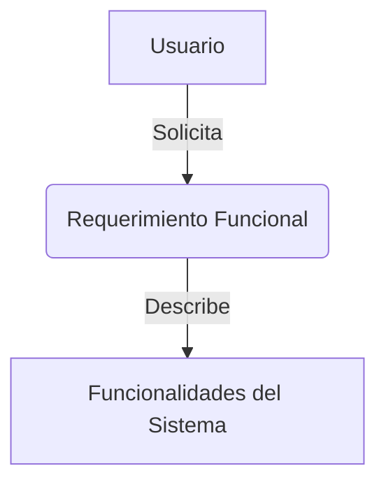
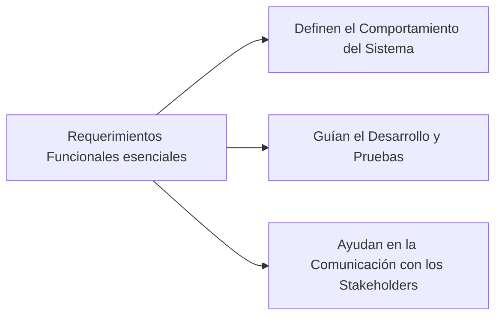
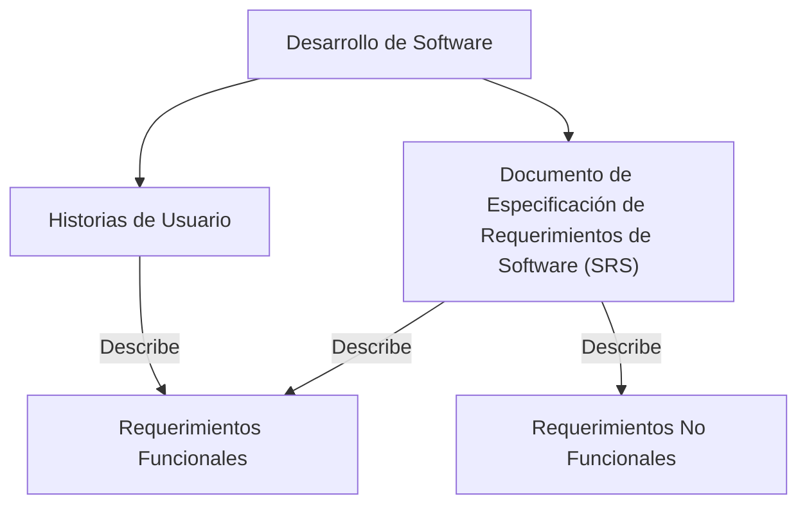
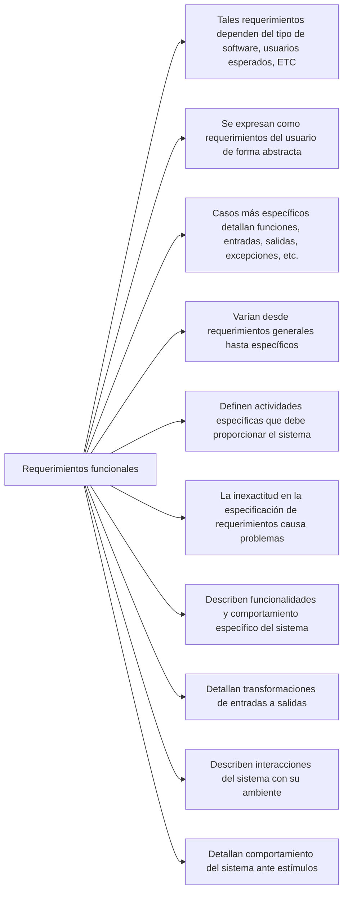

# Requerimientos Funcionales: Un Pilar Fundamental en el Desarrollo de Software

## Introducción

Los requerimientos funcionales son una parte integral de cualquier proyecto de desarrollo de software. Son las especificaciones que describen lo que un sistema debe hacer o las funciones que debe realizar. En este artículo, exploraremos en profundidad los requerimientos funcionales, su importancia, cómo se documentan y algunos ejemplos para ilustrar estos conceptos.

## ¿Qué son los Requerimientos Funcionales?

Los requerimientos funcionales describen las funcionalidades o servicios que un sistema debe proporcionar. Son las acciones que un sistema debe realizar para cumplir con sus objetivos. Estos requerimientos se centran en el "qué" en lugar del "cómo", es decir, describen lo que el sistema debe hacer, no cómo debe hacerlo.

Por ejemplo, en un sistema de comercio electrónico, algunos requerimientos funcionales podrían ser: "El sistema debe permitir a los usuarios buscar productos", "El sistema debe permitir a los usuarios añadir productos a un carrito de compras" o "El sistema debe permitir a los usuarios realizar pagos a través de tarjetas de crédito".

## Importancia de los Requerimientos Funcionales

Los requerimientos funcionales son esenciales por varias razones:

1. **Definen el Comportamiento del Sistema**: Los requerimientos funcionales definen las funciones y capacidades que el sistema debe tener. Proporcionan una descripción detallada de cómo se espera que el sistema se comporte en diversas situaciones.
2. **Guían el Desarrollo y Pruebas**: Los requerimientos funcionales actúan como una guía para los desarrolladores durante el proceso de desarrollo. También proporcionan una base para las pruebas de aceptación, ya que cada requerimiento funcional debe ser probado para asegurar que el sistema funciona como se esperaba.
3. **Ayudan en la Comunicación con los Stakeholders**: Los requerimientos funcionales ayudan a comunicar las expectativas y objetivos del sistema a todas las partes interesadas, incluyendo los clientes, los usuarios, los desarrolladores y los testers.
4. 

## Documentación de los Requerimientos Funcionales

La documentación de los requerimientos funcionales es un paso crucial en el proceso de desarrollo de software. Los requerimientos funcionales deben ser documentados de manera clara y precisa para evitar cualquier malentendido o ambigüedad.

Una forma común de documentar los requerimientos funcionales es a través de un Documento de Especificación de Requerimientos de Software (SRS). Un SRS es un documento detallado que describe los requerimientos del sistema, tanto funcionales como no funcionales.

Otra forma de documentar los requerimientos funcionales es a través de historias de usuario. Una historia de usuario es una descripción simple y concisa de una característica del sistema desde la perspectiva del usuario. Por ejemplo, una historia de usuario podría ser: "Como usuario, quiero poder buscar productos para que pueda encontrar lo que necesito".

## Ejemplos de Requerimientos Funcionales

Para ilustrar los conceptos discutidos, consideremos algunos ejemplos de requerimientos funcionales para un sistema de comercio electrónico:

1. "El sistema debe permitir a los usuarios buscar productos por nombre, categoría o precio".
2. "El sistema debe permitir a los usuarios añadir productos a un carrito de compras".
3. "El sistema debe permitir a los usuarios realizar pagos a través de tarjetas de crédito, débito o PayPal".
4. "El sistema debe enviar un correo electrónico de confirmación a los usuarios después de realizar una compra".
5. "El sistema debe permitir a los usuarios ver su historial de pedidos".

