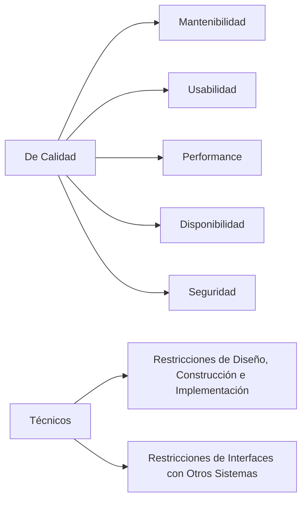

# Requerimientos No Funcionales: Un Componente Esencial en el Desarrollo de Software

## Introducción

En el desarrollo de software, los requerimientos juegan un papel crucial en la definición de lo que un sistema debe hacer y cómo debe comportarse. Mientras que los requerimientos funcionales se centran en las funcionalidades específicas que un sistema debe proporcionar, los requerimientos no funcionales se ocupan de las características generales que el sistema debe tener. En este artículo, exploraremos en profundidad los requerimientos no funcionales, su importancia y cómo se documentan.

## ¿Qué son los Requerimientos No Funcionales?

Los requerimientos no funcionales, también conocidos como "atributos de calidad", son las especificaciones que describen cómo un sistema debe comportarse y operar. Estos requerimientos se centran en las características del sistema, como su rendimiento, seguridad, usabilidad, fiabilidad, entre otros, en lugar de las funcionalidades específicas que debe proporcionar.

Por ejemplo, en un sistema de comercio electrónico, algunos requerimientos no funcionales podrían ser: "El sistema debe ser capaz de manejar al menos 1000 usuarios concurrentes", "El sistema debe cifrar los datos de las tarjetas de crédito para proteger la información del cliente", o "El sistema debe tener un tiempo de respuesta de no más de 2 segundos".

## Importancia de los Requerimientos No Funcionales

Los requerimientos no funcionales son esenciales por varias razones:

1. **Impactan la Experiencia del Usuario**: Los requerimientos no funcionales como la usabilidad, el rendimiento y la fiabilidad tienen un impacto directo en la experiencia del usuario. Un sistema puede tener todas las funcionalidades que los usuarios necesitan, pero si es lento, difícil de usar o poco fiable, los usuarios probablemente no estarán satisfechos.
2. **Afectan la Viabilidad del Sistema**: Algunos requerimientos no funcionales, como la seguridad y la escalabilidad, pueden afectar la viabilidad del sistema. Si un sistema no es seguro o no puede escalar para manejar un aumento en la demanda, puede no ser viable a largo plazo.
3. **Influyen en el Costo y el Esfuerzo de Desarrollo**: Los requerimientos no funcionales pueden tener un impacto significativo en el costo y el esfuerzo de desarrollo. Por ejemplo, desarrollar un sistema que sea altamente seguro o que tenga un alto rendimiento puede requerir más tiempo y recursos.

## Documentación de los Requerimientos No Funcionales

La documentación de los requerimientos no funcionales es un paso crucial en el proceso de desarrollo de software. Los requerimientos no funcionales deben ser documentados de manera clara y precisa para evitar cualquier malentendido o ambigüedad.

Una forma común de documentar los requerimientos no funcionales es a través de un Documento de Especificación de Requerimientos de Software (SRS). Un SRS es un documento detallado que describe los requerimientos del sistema, tanto funcionales como no funcionales.

Otra forma de documentar los requerimientos no funcionales es a través de casos de uso. Un caso de uso es una descripción de cómo un usuario interactúa con el sistema para lograr un objetivo específico. Los casos de uso pueden ayudar a identificar requerimientos no funcionales al mostrar cómo los usuarios esperan que el sistema se comporte.

## Conclusión

Los requerimientos no funcionales son un componente esencial en el desarrollo de software. Definen las características y propiedades que un sistema debe tener y pueden tener un impacto significativo en la experiencia del usuario, la viabilidad del sistema y el costo y esfuerzo de desarrollo. Al documentar los requerimientos no funcionales de manera clara y precisa, los equipos de desarrollo pueden asegurarse de que están construyendo un sistema que cumple con las expectativas de los usuarios y los clientes.