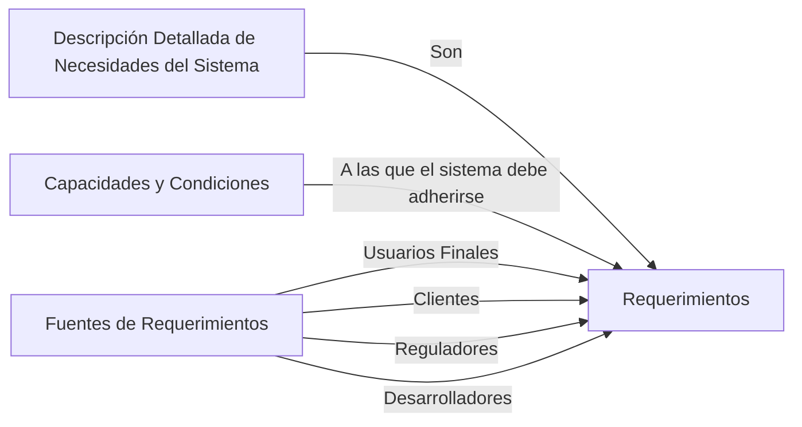
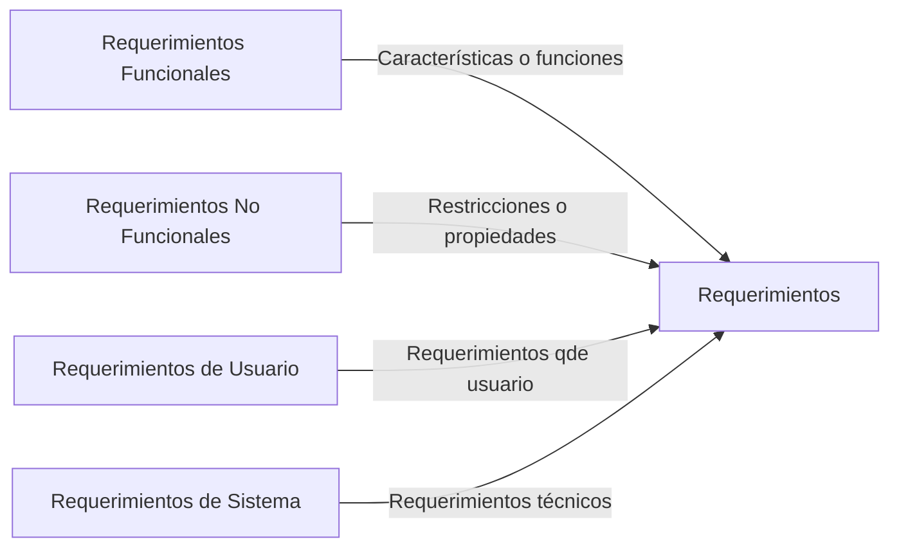
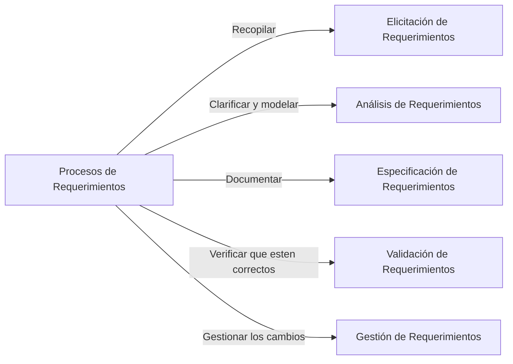
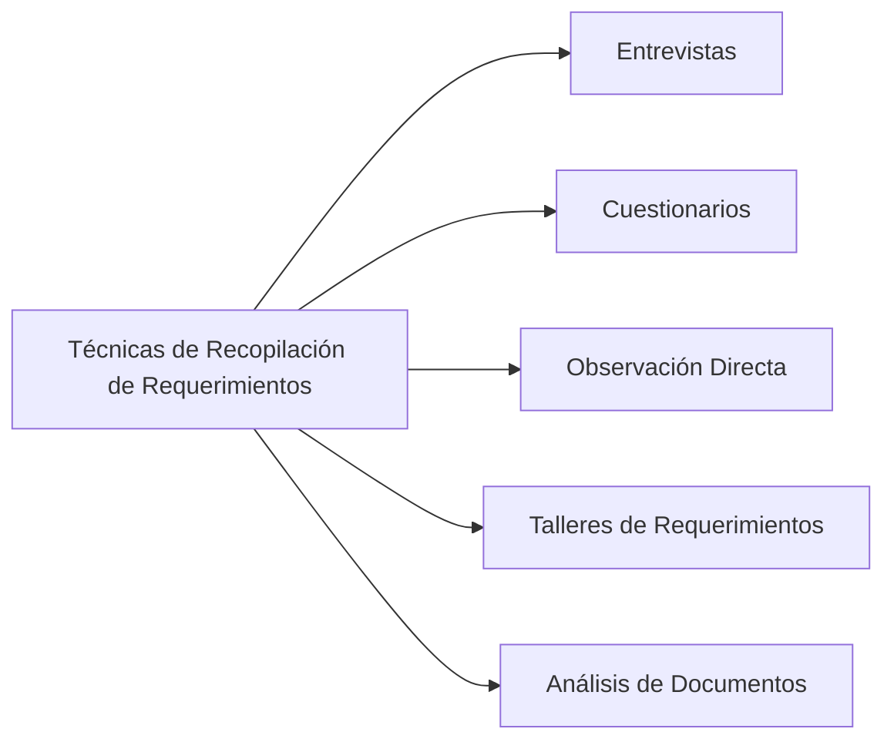
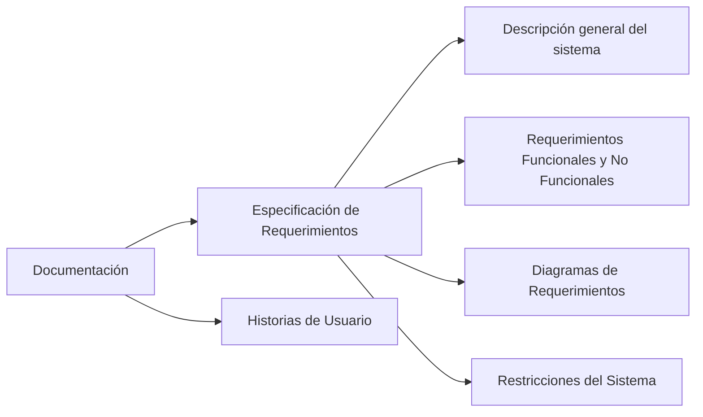
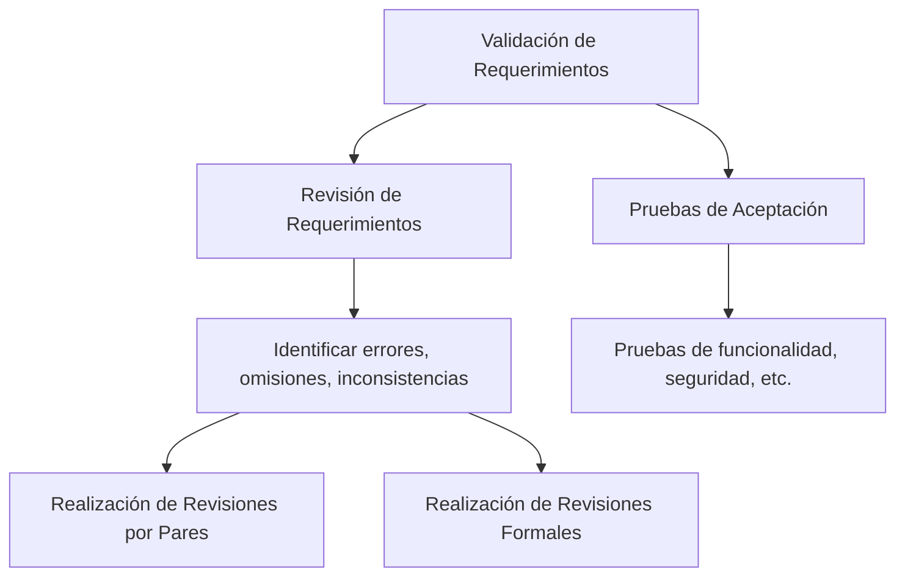
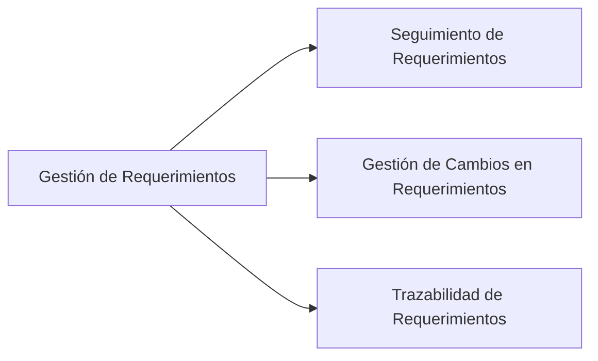

# Requerimientos en Ingeniería de Requerimientos

## Tabla de Contenidos

- Introducción
- ¿Qué son los Requerimientos?
- Tipos de Requerimientos
- Proceso de Ingeniería de Requerimientos
- Técnicas de Elicitación de Requerimientos
- Documentación de Requerimientos
- Validación de Requerimientos
- Gestión de Requerimientos
- Ejemplos de Requerimientos
- Conclusión

## Introducción

La ingeniería de requerimientos es una disciplina fundamental en el desarrollo de software. Es el proceso de definir, documentar y mantener los requerimientos en el contexto de la ingeniería de sistemas y software. En este documento, exploraremos en detalle qué son los requerimientos, los diferentes tipos de requerimientos, el proceso de ingeniería de requerimientos, y proporcionaremos numerosos ejemplos para una mejor comprensión.

## ¿Qué son los Requerimientos?

Los requerimientos son una descripción detallada de las necesidades del sistema que se va a desarrollar. Son las capacidades y condiciones a las que el sistema debe adherirse. Los requerimientos pueden provenir de varias fuentes, como los usuarios finales, los clientes, los reguladores y los desarrolladores.

Por ejemplo, si estamos desarrollando un sistema de reservas de hotel, un requerimiento podría ser: "El sistema debe permitir a los usuarios buscar habitaciones disponibles en función de la ubicación, las fechas de reserva y el número de huéspedes".

## Tipos de Requerimientos

Los requerimientos se pueden clasificar en varios tipos, incluyendo requerimientos funcionales, requerimientos no funcionales, requerimientos de usuario, requerimientos de sistema, entre otros.

- **Requerimientos Funcionales**: Son las características o funciones que un sistema debe realizar. Por ejemplo, "El sistema debe permitir a los usuarios registrarse utilizando su dirección de correo electrónico".
- **Requerimientos No Funcionales**: Son las restricciones o propiedades que el sistema debe tener, como la seguridad, el rendimiento, la usabilidad, etc. Por ejemplo, "El sistema debe ser capaz de manejar al menos 1000 usuarios concurrentes".
- **Requerimientos de Usuario**: Son los requerimientos que provienen directamente de los usuarios o clientes. Por ejemplo, "Como usuario, quiero poder restablecer mi contraseña en caso de que la olvide".
- **Requerimientos de Sistema**: Son los requerimientos que describen lo que el sistema debe hacer desde una perspectiva técnica. Por ejemplo, "El sistema debe almacenar los datos de los usuarios en una base de datos SQL".
- 

## Proceso de Ingeniería de Requerimientos

El proceso de ingeniería de requerimientos incluye varias etapas, como la elicitación de requerimientos, el análisis de requerimientos, la especificación de requerimientos, la validación de requerimientos y la gestión de requerimientos.

- **Elicitación de Requerimientos**: Es el proceso de recopilar los requerimientos de las diversas fuentes. Esto puede implicar la realización de entrevistas, la observación directa, la realización de encuestas, entre otros.
- **Análisis de Requerimientos**: Es el proceso de entender, clarificar y modelar los requerimientos. Esto puede implicar la identificación de conflictos o inconsistencias, la priorización de los requerimientos, la creación de modelos de requerimientos, entre otros.
- **Especificación de Requerimientos**: Es el proceso de documentar los requerimientos de una manera clara, concisa y completa. Esto puede implicar la creación de un Documento de Especificación de Requerimientos (SRS), que es un documento detallado que describe los requerimientos del sistema.
- **Validación de Requerimientos**: Es el proceso de verificar que los requerimientos son correctos, completos, consistentes y realizables. Esto puede implicar la revisión de los requerimientos, la realización de pruebas de aceptación, entre otros.
- **Gestión de Requerimientos**: Es el proceso de gestionar los cambios en los requerimientos a lo largo del ciclo de vida del proyecto. Esto puede implicar el seguimiento de los requerimientos, la gestión de los cambios en los requerimientos, la trazabilidad de los requerimientos, entre otros.

## Técnicas de Elicitación de Requerimientos

Existen varias técnicas para la elicitación de requerimientos, incluyendo las entrevistas, los cuestionarios, la observación directa, los talleres de requerimientos, el análisis de documentos, entre otros.

- **Entrevistas**: Las entrevistas pueden ser una forma efectiva de recopilar requerimientos. Pueden ser formales o informales, y pueden ser realizadas en persona o a través de medios electrónicos. Las entrevistas permiten obtener una comprensión profunda de las necesidades y expectativas de los usuarios.
- **Cuestionarios**: Los cuestionarios pueden ser útiles para recopilar requerimientos de un gran número de usuarios. Pueden ser distribuidos en papel o a través de medios electrónicos. Los cuestionarios permiten obtener una amplia gama de perspectivas y pueden ser analizados cuantitativamente.
- **Observación Directa**: La observación directa implica observar a los usuarios mientras realizan sus tareas habituales. Esto puede proporcionar una comprensión detallada de las tareas que los usuarios realizan, los problemas que encuentran y las necesidades que tienen.
- **Talleres de Requerimientos**: Los talleres de requerimientos son reuniones en las que se reúnen varias partes interesadas para discutir y acordar los requerimientos. Los talleres de requerimientos pueden ser una forma efectiva de identificar y resolver conflictos de requerimientos.
- **Análisis de Documentos**: El análisis de documentos implica revisar los documentos existentes, como los manuales de usuario, las especificaciones de sistema, los informes de problemas, entre otros, para identificar los requerimientos.

## Documentación de Requerimientos

La documentación de requerimientos es un aspecto crucial de la ingeniería de requerimientos. Los requerimientos deben ser documentados de una manera que sea clara, concisa, completa y comprensible para todas las partes interesadas.

Una forma común de documentar los requerimientos es a través de un Documento de Especificación de Requerimientos (SRS). Un SRS es un documento detallado que describe los requerimientos del sistema. Puede incluir una descripción general del sistema, una lista detallada de los requerimientos funcionales y no funcionales, los diagramas de los requerimientos, las restricciones del sistema, entre otros.

Otra forma de documentar los requerimientos es a través de historias de usuario. Una historia de usuario es una descripción simple y concisa de una característica del sistema desde la perspectiva del usuario. Por ejemplo, una historia de usuario podría ser: "Como usuario, quiero poder buscar habitaciones de hotel disponibles para que pueda hacer una reserva".

## Validación de Requerimientos

La validación de requerimientos es el proceso de verificar que los requerimientos son correctos, completos, consistentes y realizables. Esto puede implicar la revisión de los requerimientos, la realización de pruebas de aceptación, entre otros.

La revisión de requerimientos implica examinar los requerimientos para identificar cualquier error, omisión, ambigüedad o inconsistencia. Esto puede implicar la realización de revisiones por pares, donde un miembro del equipo revisa el trabajo de otro, o la realización de revisiones formales, donde un equipo de revisión examina los requerimientos.

Las pruebas de aceptación son pruebas que se realizan para determinar si el sistema cumple con los requerimientos. Estas pruebas son a menudo realizadas por los usuarios finales y pueden incluir pruebas de funcionalidad, pruebas de rendimiento, pruebas de seguridad, entre otras.

## Gestión de Requerimientos

La gestión de requerimientos es el proceso de gestionar los cambios en los requerimientos a lo largo del ciclo de vida del proyecto. Esto puede implicar el seguimiento de los requerimientos, la gestión de los cambios en los requerimientos, la trazabilidad de los requerimientos, entre otros.

El seguimiento de requerimientos implica mantener un registro de todos los requerimientos y su estado. Esto puede implicar el uso de una herramienta de seguimiento de requerimientos, que puede ayudar a asegurar que todos los requerimientos sean considerados y que ningún requerimiento se pierda o se olvide.

La gestión de cambios en los requerimientos implica gestionar cualquier cambio en los requerimientos. Esto puede implicar la evaluación de los cambios propuestos, la decisión de si aceptar o rechazar los cambios, y la implementación de los cambios aceptados.

La trazabilidad de los requerimientos implica mantener un registro de la relación entre los requerimientos y los artefactos del sistema, como el código fuente, los casos de prueba, la documentación del usuario, entre otros. Esto puede ayudar a entender el impacto de los cambios en los requerimientos y a asegurar que todos los requerimientos sean implementados y probados.

## Ejemplos de Requerimientos

Para ilustrar los conceptos discutidos, consideremos algunos ejemplos de requerimientos para un sistema de reservas de hotel.

- **Requerimiento Funcional**: "El sistema debe permitir a los usuarios buscar habitaciones disponibles en función de la ubicación, las fechas de reserva y el número de huéspedes".
- **Requerimiento No Funcional**: "El sistema debe ser capaz de manejar al menos 1000 usuarios concurrentes".
- **Requerimiento de Usuario**: "Como usuario, quiero poder ver las fotos y las descripciones de las habitaciones para que pueda tomar una decisión informada".
- **Requerimiento de Sistema**: "El sistema debe almacenar los datos de las reservas en una base de datos SQL para permitir la recuperación y el análisis de los datos".

## Conclusión

La ingeniería de requerimientos es una disciplina fundamental en el desarrollo de software. Los requerimientos son una descripción detallada de las necesidades del sistema que se va a desarrollar. El proceso de ingeniería de requerimientos incluye la elicitación, el análisis, la especificación, la validación y la gestión de los requerimientos. A través de numerosos ejemplos, hemos explorado en detalle estos conceptos y esperamos que este documento le ayude a entender mejor la importancia y la complejidad de la ingeniería de requerimientos.
